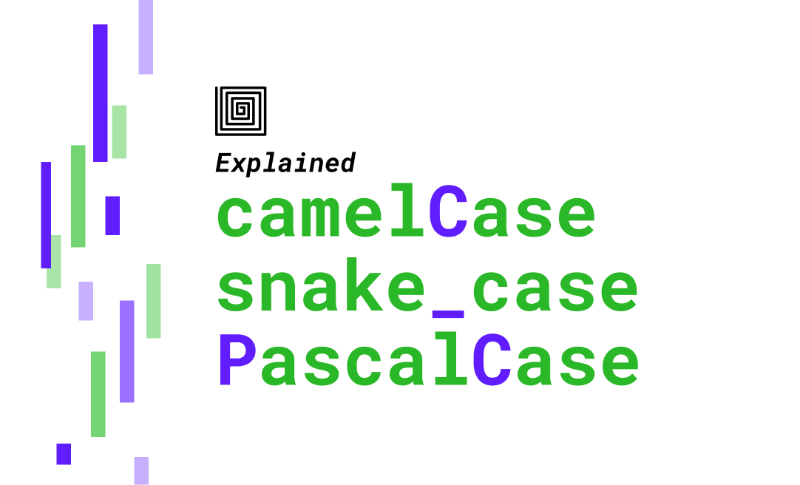

# CRMS SQL Naming Convention
This is a guide on the naming convention for Central Results Management System (CRMS)

 

### Overall Case formatting:
<table>
    <thead>
        <tr>
            <th>Fields</th>
            <th>Case
        </tr>
    </thead>
    <tbody>
        <tr>
            <td>Database names</td>
            <td>Lower case</td>
        </tr>
        <tr>
            <td>Table names</td>
            <td>Pascal case + snake case</td>
        </tr>
        <tr>
            <td>Column names</td>
            <td>Lower case</td>
        </tr>
        <tr>
            <td>Keys and Indexes</td>
            <td>Prefix = uppercase</td>
        </tr>
    </tbody>
</table>

 

### Definition of Case formatting:

Refer to the picture below to understand the different case formatting.

## Database
Database names will be **lowercase** (no numbers or special characters like "_" or "-").

## Tables
Table names will be in **PascalCasing** (camelCasing with the first letter also capitalized) and **singular**. E.g. AthleteTeam.

### Many to Many Tables
For many to many tables, table names will be concatenated with underscore '**_**'. E.g. Competition_CompetitionCategory.

## Columns
Column names will be **singular** and **lowercase** except for prefixes and suffixes. <u>All prefixes and suffixes</u> should be in **uppercase**. Column names with more than one word will be joined using underscores '**_**'

## Keys and Indexes

### Primary Keys
Primary Keys will be prefixed with '**PK_**'

### Foreign Keys
Foreign Keys will be prefixed with '**FK_**'

### Indexes
Indexes will be prefixed with '**IDX_**'

## Data Types Format

### Date
Date fields will be in the format "**<i>YYYY-MM-DD</i>**"

### DateTime
Date fields will be in the format "**<i>YYYY-MM-DD HH:MM:SS</i>**"

### Time
Time fields will be in the format "**<i>HH:MM:SS</i>**"